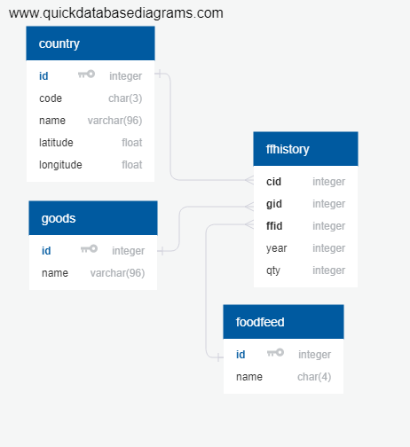

## Описание данных ##
 

 
### Описание таблиц и полей ###

Таблица **country** - справочник с названиями стран, аббревиатурами и географическим расположением столиц ( latitude / longitude )  
Поля  
`id integer PRIMARY KEY,     - Уникальный код страны`   	
`code char(3) NOT NULL,      - Уникальный код страны` 
`name varchar(96) NOT NULL,  - Уникальный код страны` 
`latitude float,             - Уникальный код страны` 
`longitude float             - Уникальный код страны` 
